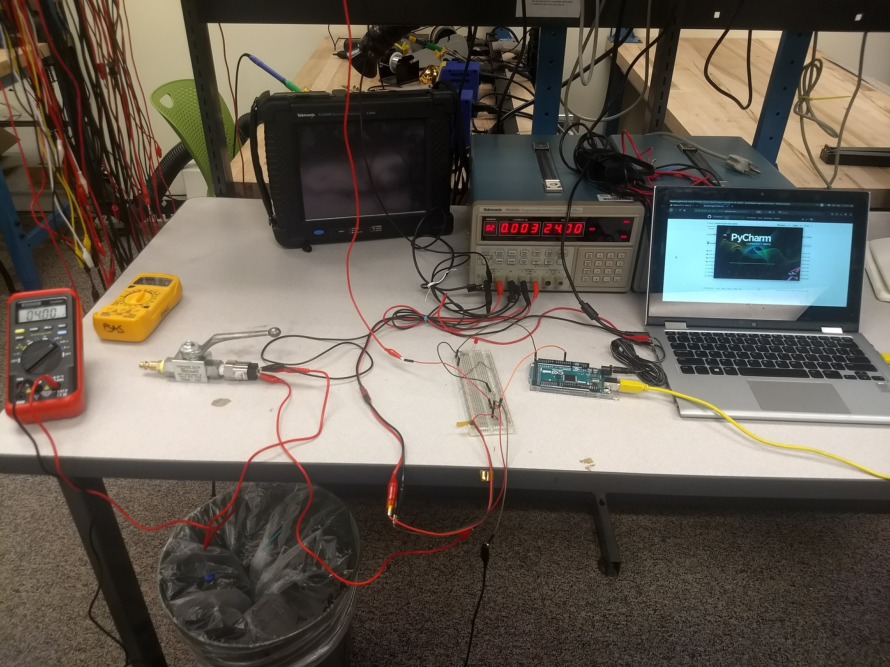
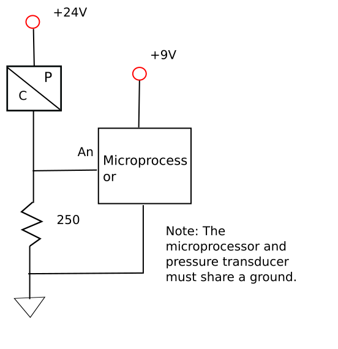
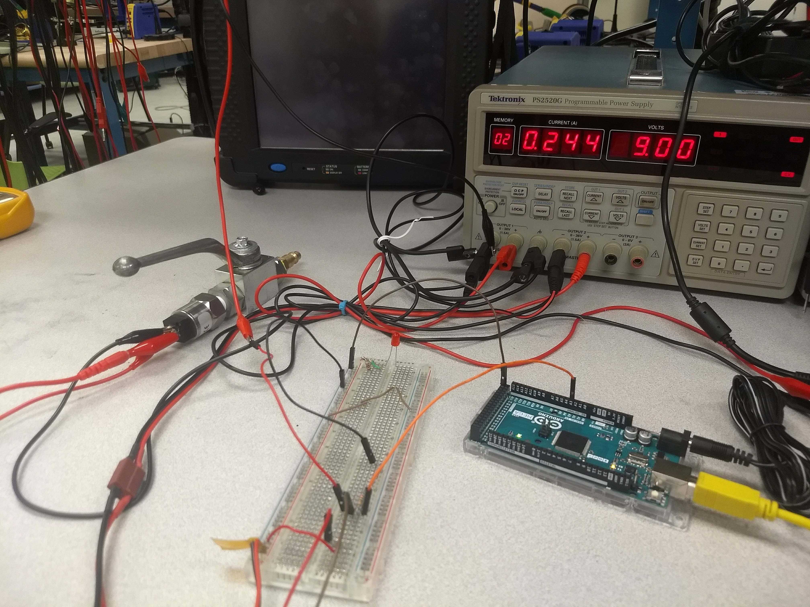

### TSAR Arduino MEGA2560 based Pressure Transducer System

This Pressure Transducer repository contains the Arduino code and Python code for measuring data from the Arduino ATMEGA2560 analog pins 0 - 15, displaying this data, and writing the data out to a time stamped csv. The basic usage is detailed below. See the figure below for the setup. Note that it shows the Arduino and pressure transducer sharing a ground although at different voltage levels (9V, 24V respectively) this is critical. The program has much more potential functionality, investigate the unused code blocks to learn more features.

Author: Mark Musil B.S.E.E. Portland State Univ, Oregon. March 2018
Foward questions to mmusil@pdx.edu






#### Configuring the Arduino 

The Arduino '.ino' file to upload is 'ArduinoPC2.ino' the one marked original was the reference code and will not function. The following list details the most important pieces of the Arduino code that you may want to change. The code has many other features such as servo control that I chose not to use. 

1. Update Interval: Change the delay in __replyToPC()__ to alter how long the Arduino will wait to send its next packet. 

2. Which pins to measure: Alter the pin reading set in the __loop()__ function.

Your Arduino must be powered by the same supply as the pressure transducer, do this by connecting 9V-12V via barrel jack to the Arduino and creating a common ground with the PT source (see figure below).

 
   
#### Configuring the Python Script

The useful file is 'ComArduino2.py' which contains all the functionality of the program. 'liveplot.py' was not completed but could be incorporated into 'ComArduino2.py' to create live plots in a Jupyter Lab/Notebook environment. 

The important parameters in the script are,

1. outputFileName: This is the name of the .csv file which will be written to upon test completion. It will be in the same directory as 'ComArduino.py'.
2. columnTitleRow: These are the column titles of the .csv
3. serPort: This must match with the serial port to which the Arduino is connected.
4. Baudrate: This must match the Arduino's baudrate.
5. psiYIntercept, psiCalibration: These variables were used to calibrate pressure input of analog pin 'A3' and is applied to all channels. You will have to alter __sliceAndWrite()__ to calibration further channels.

#### Calibration using Linear Regression

Upon succesful operation of the system, you may want to find a best fit line for your Arduino outputs vs. measured value (PSI, temp, etc.) in  order to calibrate your system. A Jupyter notebook 'Calibration.ipynb' is included in this repository which will find the average slope in your data. It does not generate a y-intercept and will require some reworking based on your specific quantity you wish to measure. 

#### Operation

1. Connect the current loop (or any analog) output to the Arduino.
2. upload your desired Arduino code. 
3. press 'run' in your Python environment. 
4. **Immediately** reset the Arduino by pressing the onboard reset button. If the Python script and the Arduino code are insync something similar to the following will begin to print,

```
Arduino is ready
[1004, 977.1428571377811, 70.12987012950582, 23.37662337650194, 8.181818181775679, 1.168831168825097, -15.194805194726262, -29.220779220627428, -35.06493506475291, -45.584415584178785, -42.07792207770349, -32.727272727102715, -26.88311688297723, -10.519480519425873, -16.363636363551358]
===========
[21003, 977.1428571377811, 71.29870129833093, 23.37662337650194, 9.350649350600776, 2.337662337650194, -5.844155844125485, -21.038961038851745, -30.389610389452525, -42.07792207770349, -39.7402597400533, -31.55844155827762, -25.714285714152133, -10.519480519425873, -10.519480519425873]
===========
[31003, 977.1428571377811, 71.29870129833093, 22.207792207676842, 8.181818181775679, 1.168831168825097, -5.844155844125485, -22.207792207676842, -31.55844155827762, -43.24675324652859, -42.07792207770349, -32.727272727102715, -28.051948051802327, -11.68831168825097, -10.519480519425873]
===========
```


__ad infinitum__

Your data will be written out to the .csv and you can stop the connection at any time without fear of harming the setup by halting the Python script.

#### Debugging

If the system is not functional the problem is most likely one of the following.

1. You did not enter the correct serial port or baudrate.
2. You did not synchronize the Arduino and Python script, repeat steps 3 and 4 above and try different timing in your resetting of the Arduino and running of the Python Script. 
3. Your circuit is not built correctly.
4. You do not have 9V - 12V going to the Arduino with a ground that is shared with the pressure transducer. This will cause erroneous readings.


